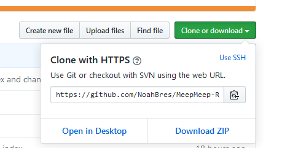
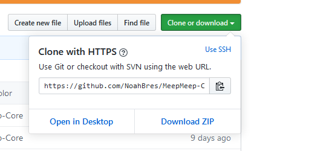
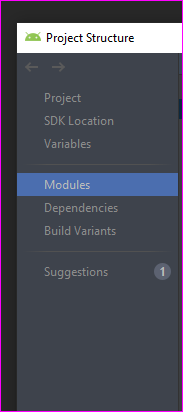
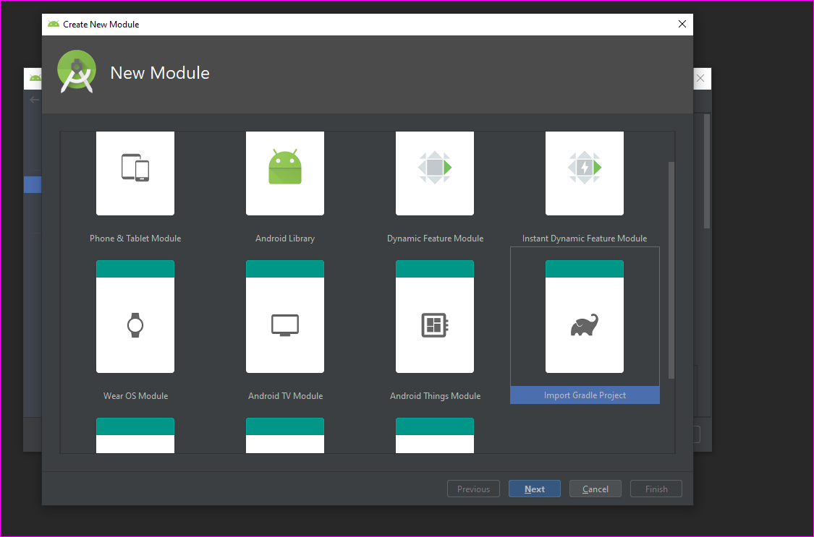
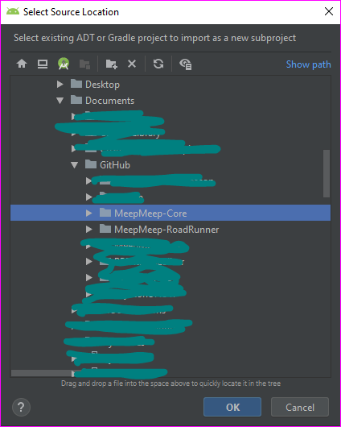
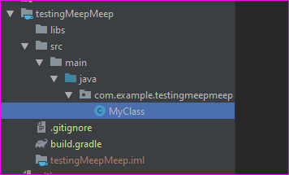

# MeepMeep

RoadRunner path visualizer/maker

Drawing z-index:
bot: 5
turn indicator: 4
marker indicator: 3
trajectory: 2
axes: 1


## MeepMeep: Android Studio Installation Guide

**THIS GUIDE IS CURRENTLY FOR ALPHA!**
The process will most likely change in the future!

1. Clone both the [MeepMeep-Core](https://github.com/NoahBres/MeepMeep-Core "MeepMeep-Core") repository and the [MeepMeep-RoadRunner](https://github.com/NoahBres/MeepMeep-RoadRunner "MeepMeep-RoadRunner") repository. Take note of their location.


  
  
  
2. Open the project you want to add MeepMeep to in Android Studio. (Optional: The "Project" view might make some things easier) Open the Project Structure by A) Going to File > Project Structure or B) Finding the  icon. Then, Navigate to the "Modules" section.

  
  
3. Click the "+" icon on the top left of the modules section. This will then ask you the type of new module you want. Find the "Import Gradle Project" option and select it. Then click "Next".

  
  
4. The screen will then ask you for a source directory. Provide the path of the MeepMeep-Core folder you cloned OR click the folder icon to navigate to the folder and select it.

  
  
5. Click "Finish" and wait for the triggered Gradle Sync in the background to finish. Back in the Modules section, again click on the "+" icon to add a new module, repeat steps 3 and 4 to get the MeepMeep-RoadRunner folder (Instead of selecting the MeepMeep-Core folder in step 4, select the MeepMeep-RoadRunner folder). Click "Finish" and then exit the Prohect Structures box by pressing "Apply" and then "Ok". Wait once again for the background Gradle Sync to finish

  
  
6. MeepMeep is now imported! Now we need to set up a way to use it. Create a new Module by going to File > New > New Module. Select "Java Library" for the type and then fill out a name for the module. Press "Finish" when you are done and wait for the Gradle Sync to complete.

7. Open the `build.gradle` file in your new module and edit it to match the following.

```groovy
apply plugin: 'java-library'

dependencies {
    implementation fileTree(dir: 'libs', include: ['*.jar'])

    implementation 'com.acmerobotics.roadrunner:core:0.5.0' //Replace 0.5.0 with highest RoadRunner release if needed

    implementation project(":MeepMeep-RoadRunner") //Name of your MeepMeep-RoadRunner download
    implementation project(":MeepMeep-Core") //Name of your MeepMeep-Core download
}

sourceCompatibility = "8"
targetCompatibility = "8"
```
Trigger a Gradle Sync once you are done

8. Navigate to the "main code" (hard to explain lol) part of the module directory (if you left most things at default when you created the module in step 6, this should be under `src/main/java/com.example.testingmeepmeep` where a `MyClass.java` file is that Android Studio automatically creates).

Example "Main Code Dir" (the module name is "testingMeepMeep" in this image):


9. Add a new java class called "MeepMeepTesting" in that location (the exact name is optional, but you will have to edit the name in the following code). Copy the code found [here](docs/images/MeepMeepExample.txt) into that new file. If you choose a different class file name, change the name in the code. Make sure you change the package name to your correct one. There is also the possibility of other, more obscure errors which may need to be resolved if they are specific to your enviornment.
  
  
**IMPORTANT NOTE FOR NEXT STEP**: The following video is up to date, however on thing it does *not* show is changing the working directory of the configuration. By defualt, this field is usually the location of the current project, however, this must be changed to the location of the "MeepMeep-Core" module *inside* the project (Example (Names and locations are made up): The default name of the project is "MyProject", at the location of "C:\Users\Randy\Documents\GitHub\MyProject". The working directory should be "C:\Users\Randy\Documents\GitHub\MyProject\MeepMeep-Core").

10. Set up a configuration using [this](https://github.com/Lunerwalker2/MeepMeepRyan/blob/master/docs/images/QtUApgcWPU.mp4?raw=true) video.

11. Once the Gradle Build finishes, the simulator should run! 


